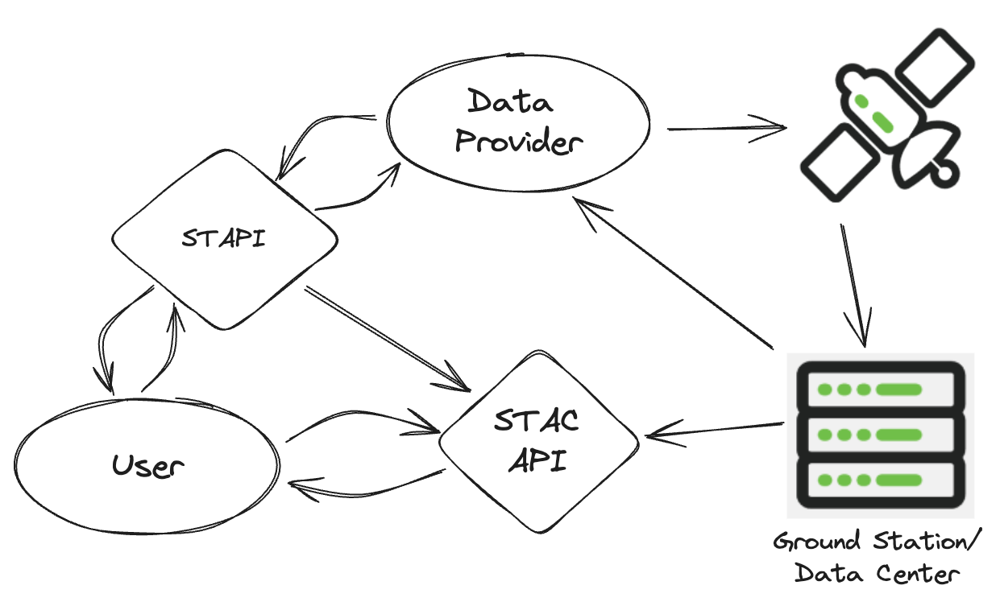
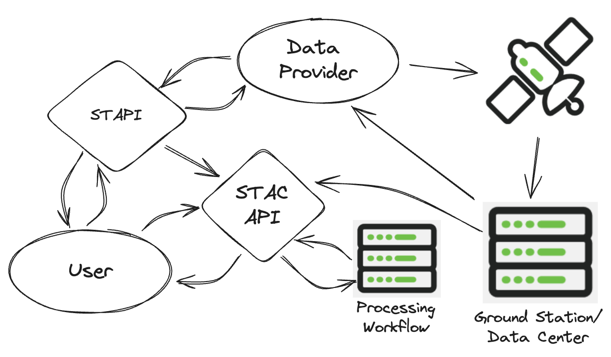

# Sensor Tasking API (STAPI)

## Table of Contents
- [Sensor Tasking API (STAPI)](#sensor-tasking-api-stapi)
  - [Table of Contents](#table-of-contents)
  - [About](#about)
  - [Introduction](#introduction)
  - [STAPI Description](#stapi-description)
    - [Core](#core)
      - [Landing Page](#landing-page)
        - [Relation Types](#relation-types)
    - [Opportunities](#opportunities)
  - [Endpoints](#endpoints)
  - [Conformance Classes](#conformance-classes)
    - [Conformance Class Table](#conformance-class-table)
  - [Example workflows](#example-workflows)

## About
The Sensor Tasking API (STAPI) defines a JSON-based web API to query for potential future data
and place orders ("tasking") for potential future data from geospatial data providers. The core STAPI
specification provides a structure and language to describe **Products**, **Opportunities**, and **Orders**.
The process of interacting with a data provider is done through a REST API.

Ideally, STAPI requests to providers will be ultimately fulfilled by creating one or more STAC Items,
so STAPI aims to align with STAC core and extensions. Users of STAC will notice many similarities 
in the concepts and names used in STAPI. STAPI is also, like STAC, based on OGC APIs and use 
Conformance Classes to describe supported API features.

In the example below STAPI is being used to order future data from a satelite data provider. 
The user can search an archive of data using the STAC API, or order data to be collected in the future from
the STAPI. When an STAPI order is fulfilled it will contain links to the STAC Items in the STAC API.



STAPI can also be used for ordering derived geospatial products. In this more complex example the
user orders a derived product that requires some additional processing. The order is fulfilled 
by tasking the appropriate satellite imagery then running a processing workflow to generate some
derived data. Note that in this case the data provider could be using another data provider for
getting the imagery through another STAPI.



## Introduction

## STAPI Description

### Core

- **Conformance URI:** <https://stapi.example.com/v0.1.0/core>
- [OpenAPI document](openapi.yaml)
- [Rendered API documentation](https://stapi-spec.github.io/stapi-spec/dev/)

The core of STAPI includes the `/products` endpoint and the `/orders` endpoint.

To know which parameters are available for which `productId`, users first explore [/products](./product).
These parameters can be used to form a POST to the `/products/{productId}/order` endpoint.

#### Landing Page

- [Example](core/examples/landingpage.json)

Fields that can be included in the response body for `GET /`.

| Field Name  | Type            | Description                                                  |
| ----------- | --------------- | ------------------------------------------------------------ |
| id          | string          | **REQUIRED.** Identifier for the API.                        |
| conformsTo  | \[string\]      | **REQUIRED.** Conformance classes that apply to the API globally. |
| title       | string          | A short descriptive one-line title for the API.              |
| description | string          | **REQUIRED.** Detailed multi-line description to fully explain the API. [CommonMark 0.29](http://commonmark.org/) syntax MAY be used for rich text representation. |
| links       | \[Link Object\] | **REQUIRED.** A list of references to other documents and endpoints. |

##### Relation Types

| Endpoint                                   | Relation Type        |
|--------------------------------------------| -------------------- |
| `GET /conformance`                         | `conformance`        |
| `GET /products`                            | `products`           |
| `GET /products/{productId}`                | `product`            |
| `GET /products/{productId}/parameters`     | `product-parameters` |
| `GET /orders`                              | `orders`             |
| `POST /products/{productId}/order`         | `create-order`       |
| `GET /orders/{orderId}`                    | `order`              |
| `GET /orders/{orderId}/status`             | `status`             |
| `POST /products/{productId}/opportunities` | `opportunities`      |

`create-order`: A link with this relation type should only be provided in the landing page
if a user can directly go from the products to the order endpoint without 
going through the `POST /products/{productId}/opportunities` endpoint.

### Opportunities

The `POST /products/{productId}/opportunities` endpoint provides additional functionality on top of core and is designed to be used
after `GET /products` and before `POST /products/{productId}/order`. It allows users more fine-grained 
control and selection of available tasking opportunities by letting them explore the opportunities which 
are available for a chosen order configuration. The opportunities are 
represented in a FeatureCollection, with order specific attributes and values in the feature properties.

## Endpoints

STAPI follow the modern web API practices of using HTTP Request Methods ("verbs") and
the `Content-Type` header to drive behavior on resources ("nouns") in the endpoints listed below.

The following table describes the service resources available in a STAPI implementation that
supports all three of the foundation specifications. Note that the 'Endpoint'
column is more of an example in some cases.

| Endpoint                                  | Specified in  | Accepts                                                      | Returns                                                      | Description                                                                                                                                                                                                                         |
|-------------------------------------------| ------------- | ------------------------------------------------------------ | ------------------------------------------------------------ |-------------------------------------------------------------------------------------------------------------------------------------------------------------------------------------------------------------------------------------|
| `GET /`                                   | Core          | -                                                            | [Landing Page](#landing-page)                                |                                                                                                                                                                                                                                     |
| `GET /conformance`                        | Core          | -                                                            | Conformance Classes                                          |                                                                                                                                                                                                                                     |
| `GET /products`                           | Core          | -                                                            | [Products Collection](./product/README.md)                   | Figure out which constraints are available for which `productId`                                                                                                                                                                    |
| `GET /products/{productId}`               | Core          | -                                                            | [Product](./product/README.md)                               |                                                                                                                                                                                                                                     |
| `GET /products/{productId}/parameters`    | Core          | -                                                            | JSON Schema                                                  |                                                                                                                                                                                                                                     |
| `GET /orders`                             | Core          | -                                                            | [Orders Collection](./order/README.md#order-collection)      |                                                                                                                                                                                                                                     |
| `GET /orders/{orderId}`                   | Core          | -                                                            | [Order Object](./order/README.md#order-pobject)              |                                                                                                                                                                                                                                     |
| `POST /products/{productId}/order`        | Core          | [Order Request](./order/README.md#order-request) or any object | - | Order a capture with a particular set of [parameters](https://github.com/Element84/stapi-spec/blob/main/product/README.md#parameters) as defined in the products or a request that was provided through the opportunities endpoint. |
| `POST /products/{productId}/opportunities` | Opportunities | [Opportunity Request](./opportunity/README.md#opportunity-request) | [Opportunities Collection](./opportunity/README.md#opportunities-collection) | Explore the opportunities available for a particular set of [parameters](https://github.com/Element84/stapi-spec/blob/main/product/README.md#parameters)                                                                            |

## Conformance Classes

STAPI utilizes OGC API Features [Conformance](http://docs.opengeospatial.org/is/17-069r3/17-069r3.html#_declaration_of_conformance_classes)
JSON structure. For STAPI, we declare new STAPI conformance classes, with the core ones detailed in the table below.

The core STAPI conformance classes communicate the conformance JSON only in the root (`/`) document, while OGC API
requires they also live at the `/conformance` endpoint. STAPI's conformance structure is detailed in the
[core](core/). Note all conformance URIs serve up a rendered HTML version of the corresponding OpenAPI document at the given location.

### Conformance Class Table

| **Name**               | **Specified in**                            | **Conformance URI**                                    | **Description**                                                                                                 |
| ---------------------- | ------------------------------------------- | ------------------------------------------------------ | --------------------------------------------------------------------------------------------------------------- |
| STAPI - Core        | Core               | https://stapi.example.com/v0.1.0/core | Specifies the STAPI Landing page `/`, communicating conformance and available endpoints.                         |
| STAPI - Opportunities | [Opportunities](opportunity/README.md)        | https://stapi.example.com/v0.1.0/opportunities | Enables request of potential tasking opportunities |
| STAPI - Core | Core | https://geojson.org/schema/Point.json | Allows submitting orders with GeoJSON points |
| STAPI - Core | Core | https://geojson.org/schema/Linestring.json | Allows submitting orders with GeoJSON linestrings |
| STAPI - Core | Core | https://geojson.org/schema/Polygon.json | Allows submitting orders with GeoJSON polygons |
| STAPI - Core | Core | https://geojson.org/schema/MultiPoint.json | Allows submitting orders with GeoJSON multi points |
| STAPI - Core | Core | https://geojson.org/schema/MultiPolygon.json | Allows submitting orders with GeoJSON multi polygons |
| STAPI - Core | Core | https://geojson.org/schema/MultiLineString.json | Allows submitting orders with GeoJSON multi linestring |

See [the STAPI Demo](https://github.com/Element84/stat-api-demo)

## Pagination

STAPI supports paging through hypermedia links for the following resources:
- `GET /products`
- `POST /products/{productId}/opportunities`
- `GET /orders`
- `GET /orders/{orderId}/status`

The following relation types are available for pagination:
- `next` to provide a link to the next page
- `prev` to provide a link to the previous page (optional)
- `first` to provide a link to the first page (optional)
- `last` to provide a link to the last page (optional)

This link href must contain any request parameters that are necessary
for the implementation to understand how to provide the next page of results,
e.g., the query parameters `page`, `next`, or `token`.

For example, the links array could look like this for a API that supports
a parameter `page` and is currently on page 2:

```json
    "links": [
        {
            "rel": "prev",
            "type": "application/json",
            "href": "https://stapi.example.com/products?page=1",
            "title": "Next page"
        },
        {
            "rel": "next",
            "type": "application/json",
            "href": "https://stapi.example.com/products?page=3",
            "title": "Next page"
        }
    ]
```

The href may contain any arbitrary URL parameter, which is implementation-specific:

- `https://stac-api.example.com/collections/my_collection/items?page=2`
- `https://stac-api.example.com/collections/my_collection/items?next=8a35eba9c`
- `https://stac-api.example.com/collections/my_collection/items?token=f32890a0bdb09ac3`

In addition to supporting query parameters in the URL value of the `href` field,
the Link object can contain additional fields to support more complex HTTP requests:
- `method` to specify an HTTP method in uppercase (e.g. `GET` or `POST`),
- `headers` to add HTTP headers in the request,
- `body` with the entire body for the request.

The specification is compatible to pagination mechanisms defined in STAC API.

## Example workflows

A user with broad requirements browses available products and orders based on available opportunities.

```mermaid
sequenceDiagram
    USER->>PROVIDER: GET /products
    activate PROVIDER
    PROVIDER-->>USER: Response: Products Collection
    deactivate PROVIDER

    USER->>PROVIDER: POST /products/{productId}/opportunities
    activate PROVIDER
    PROVIDER-->>USER: Response: Opportunities Collection
    deactivate PROVIDER

    USER->>PROVIDER: POST /products/{productId}/order
    activate PROVIDER
    PROVIDER-->>USER: Response: Order Object
    deactivate PROVIDER
```

A user with a specific product in mind views available opportunities and places and order.

```mermaid
sequenceDiagram
    USER->>PROVIDER: GET /products/{productId}
    activate PROVIDER
    PROVIDER-->>USER: Response: Product Object
    deactivate PROVIDER

    USER->>PROVIDER: POST /products/{productId}/opportunities
    activate PROVIDER
    PROVIDER-->>USER: Response: Opportunities Collection
    deactivate PROVIDER

    USER->>PROVIDER: POST /products/{productId}/order
    activate PROVIDER
    PROVIDER-->>USER: Response: Order Object
    deactivate PROVIDER
```

A user with a specific product and without a specific need in mind views available products and places an order.

```mermaid
sequenceDiagram
    USER->>PROVIDER: GET /products/{productId}
    activate PROVIDER
    PROVIDER-->>USER: Response: Product Object
    deactivate PROVIDER

    USER->>PROVIDER: POST /products/{productId}/order
    activate PROVIDER
    PROVIDER-->>USER: Response: Order Object
    deactivate PROVIDER
```
